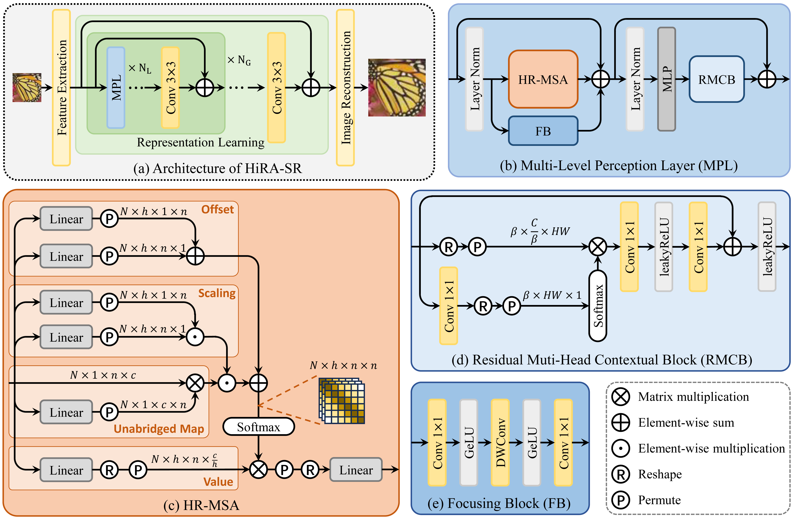
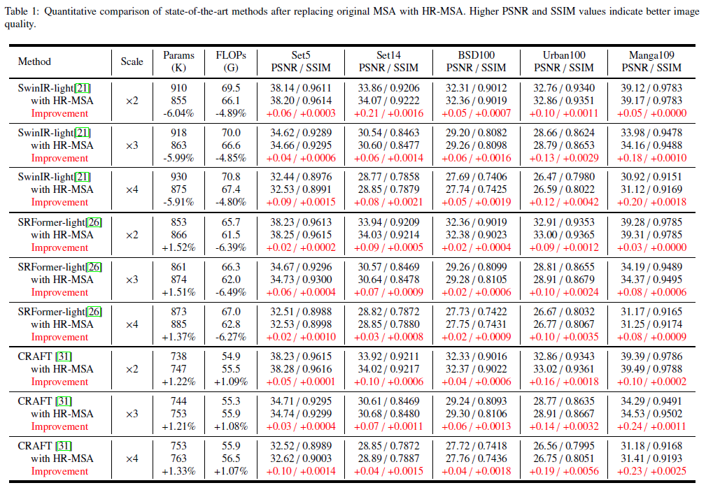
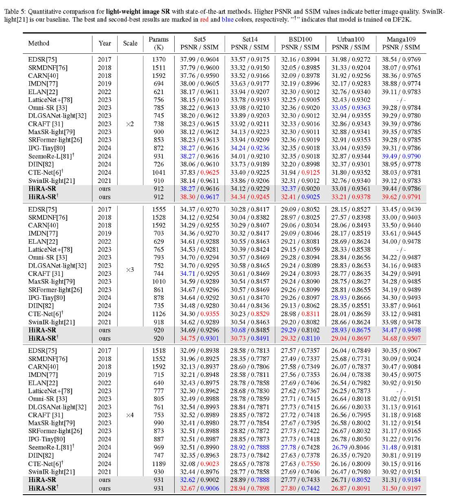

# High-rank corrected multi-head self attention for image super resolution (KBS2025)

This repository contains the official implementation of the following paper:

> Ying Yuan, Zihao Ren, Yajun Qiu, Bin Sun, Shihao Kou, Caiwen Jiang, Tianliang Zhang,
> High-rank corrected multi-head self attention for image super resolution,
> Knowledge-Based Systems,
> Volume 330, Part B,
> 2025, 114637, ISSN 0950-7051,
> https://doi.org/10.1016/j.knosys.2025.114637.



## Installation & Dataset

* This repository is based on [BasicSR](https://github.com/XPixelGroup/BasicSR)
* Python 3.10
* PyTorch >=2.1.0

```
pip install -r requirements.txt
```

* Training-Datasets : DIV2K and Flickr2K，the pretreatment is same as [SwinIR](https://github.com/XPixelGroup/BasicSR/tree/master/scripts/data_preparation).
* Validating-Datasets : Set5 + Set14 + BSD100 + Urban100 + Manga109, the pretreatment is same as [Omni-SR](https://github.com/Francis0625/Omni-SR).

## Training

Running in cmd or using `.vscode/launch.json`:

```
main/train.py --auto_resume -opt main/options/train_HiRA_SR_SRx2_DIV.yml
main/train.py --auto_resume -opt main/options/train_HiRA_SR_SRx3_DIV.yml
main/train.py --auto_resume -opt main/options/train_HiRA_SR_SRx4_DIV.yml

main/train.py --auto_resume -opt main/options/train_HiRA_SR_SRx2_DF2K.yml
main/train.py --auto_resume -opt main/options/train_HiRA_SR_SRx3_DF2K.yml
main/train.py --auto_resume -opt main/options/train_HiRA_SR_SRx4_DF2K.yml

```

This repository also contains of other architectures with HR-MSA:

* HR-MSA + [CRAFT](https://github.com/AVC2-UESTC/CRAFT-SR.git)
* HR-MSA + [SRFormer](https://github.com/HVision-NKU/SRFormer)
* HR-MSA + [OmniSR](https://github.com/Francis0625/Omni-SR)
* HR-MSA + WaveFormer (WaveFormer: Wavelet Transformer for Noise-Robust Video Inpainting, AAAI24)
* Lowrank Appromation (in section 3.2 )


## Tools & scripts

The scripts used to measure ranks are in the folder (`./tools_for_article`)


## Results

* The comparison of our HR-MSA and original MSA (same as SwinIR)



* The results of our HiRA-SR (HR-MSA + RMCB + FB)



* Visualization


## License

This code is licensed under the [Creative Commons Attribution-NonCommercial 4.0 International](https://creativecommons.org/licenses/by-nc/4.0/) for non-commercial use only. Please note that any commercial use of this code requires formal permission prior to use.

## Citations 

Thank you for your viewing and citing:

```
@article{YUAN2025114637,
title = {High-rank corrected multi-head self attention for image super resolution},
journal = {Knowledge-Based Systems},
volume = {330},
pages = {114637},
year = {2025},
issn = {0950-7051},
doi = {https://doi.org/10.1016/j.knosys.2025.114637},
url = {https://www.sciencedirect.com/science/article/pii/S0950705125016764},
author = {Ying Yuan and Zihao Ren and Yajun Qiu and Bin Sun and Shihao Kou and Caiwen Jiang and Tianliang Zhang},
}
```

